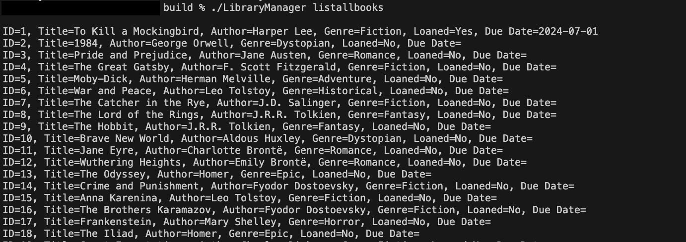
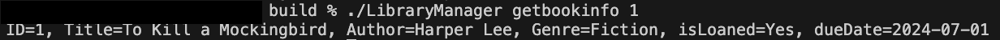

# LibraryManager

LibraryManager is a simple library management system that allows you to manage books and users, loan books, and retrieve information about books.

## Features

- Add a book
- Add a user
- Loan a book to a user
- Return a loaned book
- List all books
- Load and save library state from/to JSON files
- Retrieve information about a specific book

## Installation

1. Clone the repository:
    ```sh
    git clone https://github.com/kenjinezumi/LibraryManager.git
    cd LibraryManager
    ```

2. Create a `build` directory and navigate into it:
    ```sh
    mkdir build
    cd build
    ```

3. Run `cmake` to configure the project:
    ```sh
    cmake ..
    ```

4. Build the project:
    ```sh
    make
    ```

## Usage

Run the compiled `LibraryManager` executable with various commands (run it from the build folder):

### Commands

- **addbook**: Add a new book
    ```sh
    ./LibraryManager addbook <id> <title> <author> <genre>
    ```

- **adduser**: Add a new user
    ```sh
    ./LibraryManager adduser <id> <name>
    ```

- **loanbook**: Loan a book to a user
    ```sh
    ./LibraryManager loanbook <bookId> <userId> <dueDate>
    ```

- **returnbook**: Return a loaned book
    ```sh
    ./LibraryManager returnbook <bookId>
    ```

- **listallbooks**: List all books
    ```sh
    ./LibraryManager listallbooks
    ```

- **getbookinfo**: Retrieve information about a specific book
    ```sh
    ./LibraryManager getbookinfo <bookId>
    ```

- **loadbooks**: Load books from a JSON file
    ```sh
    ./LibraryManager loadbooks <filename>
    ```

- **savebooks**: Save books to a JSON file
    ```sh
    ./LibraryManager savebooks <filename>
    ```

- **loadusers**: Load users from a JSON file
    ```sh
    ./LibraryManager loadusers <filename>
    ```

- **saveusers**: Save users to a JSON file
    ```sh
    ./LibraryManager saveusers <filename>
    ```

## Usage

Run the compiled `LibraryManager` executable with various commands:

### Commands

- **addbook**: Add a new book
    ```sh
    ./LibraryManager addbook <id> <title> <author> <genre>
    ```

- **adduser**: Add a new user
    ```sh
    ./LibraryManager adduser <id> <name>
    ```

- **loanbook**: Loan a book to a user
    ```sh
    ./LibraryManager loanbook <bookId> <userId> <dueDate>
    ```

- **returnbook**: Return a loaned book
    ```sh
    ./LibraryManager returnbook <bookId>
    ```

- **listallbooks**: List all books
    ```sh
    ./LibraryManager listallbooks
    ```

- **getbookinfo**: Retrieve information about a specific book
    ```sh
    ./LibraryManager getbookinfo <bookId>
    ```

- **loadbooks**: Load books from a JSON file
    ```sh
    ./LibraryManager loadbooks <filename>
    ```

- **savebooks**: Save books to a JSON file
    ```sh
    ./LibraryManager savebooks <filename>
    ```

- **loadusers**: Load users from a JSON file
    ```sh
    ./LibraryManager loadusers <filename>
    ```

- **saveusers**: Save users to a JSON file
    ```sh
    ./LibraryManager saveusers <filename>
    ```

## Example

Add a book:
```sh
./LibraryManager addbook 1 "The Catcher in the Rye" "J.D. Salinger" "Fiction"
```

Add a user:
```sh
./LibraryManager adduser 1 "John Doe"
```

Loan a book:
```sh
./LibraryManager loanbook 1 1 "2024-12-31"
```

Return a book: 
```sh
./LibraryManager returnbook 1
```
List all books: 
```sh
./LibraryManager listallbooks
```

Get information about a book:
```
./LibraryManager listallbooks

```

## Screenshots of examples

List all books: 


List all books: 
